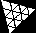

# Polyominoes Tiling in JS (Pavages de Polyominos en JavaScript)

  

In pure html, css and javascript with ES6 modules, 2 libraries: 

 **&**  [dat.GUI](https://github.com/dataarts/dat.gui)

## Description

Learn about the Polyominoes and give the solutions of tiling with one or several fixed pieces, in 2D with the Canvas API, in 3D with the three.js library.

## Preview

#### Polyominoes

#### Polycube

## Infos research & documentation

**JavaScript modules, libraries**
- [API Canvas](https://developer.mozilla.org/en-US/docs/Web/API/Canvas_API)
- [ThreeJS](https://threejs.org/)
- [dat.gui](https://github.com/dataarts/dat.gui)

**The polyominoes, polycubes**
- [Polycube Wiki](https://en.wikipedia.org/wiki/Polycube)
- [Polyomino Wiki](https://en.wikipedia.org/wiki/Polyomino)
- [Les pentominos](https://www.monunivers.com/pento/)
- [Tiling Polyominoes Game](https://demonstrations.wolfram.com/TilingPolyominoesGame/)
- [Tiling with Pentominos](https://demonstrations.wolfram.com/TilingWithPentominos/)

## Authors (Auteurs)

| Name (Nom) | N° student | GitHub  |
| -------- | ------- | ---------------------------------------- |
| Viet Nguyen | 20006303 | [Viet281101](https://github.com/Viet281101) |
| D-TheProgrammer | XXXXXXX | [D-TheProgrammer](https://github.com/D-TheProgrammer) |

## Contribution

This is a study project, but if you want to contribute, please don't hesitate.
Be free to add the Issues, Pull Requests or new features in this repository.
